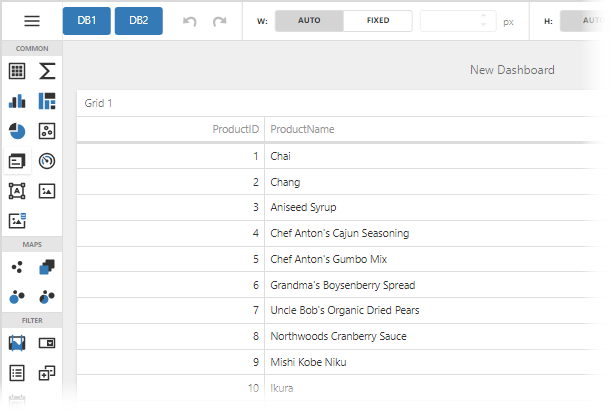

<!-- default badges list -->

<!-- default badges end -->
# Dashboard for ASP.NET Core - How to Change the Database Connection from the Web Dashboard UI

The example shows how to switch between database connections from the Web Dashboard UI. To implement conditional logic for the Web Dashboard Control, pass custom headers from the client side to the server. 

To switch between databases from the UI, add buttons corresponding to databases to the Designer Toolbox. Use the [`preparing`](https://docs.devexpress.com/Dashboard/js-DevExpress.Dashboard.Designer.DesignerToolbarExtensionOptions?p=netframework#js_devexpress_dashboard_designer_designertoolbarextensionoptions_onpreparing) event to customize the existing items in the Designer Toolbar. When a button is clicked, a custom header with the corresponding database name (*nwind*/*nwind2*) is passed with the [fetchRemoteService.headers](https://docs.devexpress.com/Dashboard/js-DevExpress.Dashboard.AjaxRemoteService#js_devexpress_dashboard_ajaxremoteservice_headers) option. After that, the [DashboardControl.reloadData](https://docs.devexpress.com/Dashboard/js-DevExpress.Dashboard.DashboardControl#js_devexpress_dashboard_dashboardcontrol_reloaddata) method is called to [reload the data](https://docs.devexpress.com/Dashboard/400983/web-dashboard/integrate-dashboard-component/dashboard-backend/manage-an-in-memory-data-cache?p=netframework#client-side). See the [customizeToolbar.js](./CS/wwwroot/js/customizeToolbar.js) file for implementation details.

On the server, the [IHttpContextAccessor](https://docs.microsoft.com/en-us/aspnet/core/fundamentals/http-context?view=aspnetcore-3.0) is used to access the passed parameter value (database name) in the [DashboardConfigurator.ConfigureDataConnection](https://docs.devexpress.com/Dashboard/DevExpress.DashboardWeb.DashboardConfigurator.ConfigureDataConnection) event handler. The [CustomStringConnectionParameters](https://docs.devexpress.com/CoreLibraries/DevExpress.DataAccess.ConnectionParameters.CustomStringConnectionParameters) class instance is used to initialize and apply a custom connection string.

## Files to Review

* [Program.cs](./CS/Program.cs)
* [customizeToolbar.js](./CS/wwwroot/js/customizeToolbar.js)
* [Index.cshtml](./CS/Pages/Index.cshtml)

## Documentation

* [Designer Toolbar](https://docs.devexpress.com/Dashboard/403426/web-dashboard/ui-elements-and-customization/designer-toolbar)
* [Manage an In-Memory Data Cache](https://docs.devexpress.com/Dashboard/400983/web-dashboard/dashboard-backend/manage-an-in-memory-data-cache).

## More Examples

* [Dashboard for ASP.NET Core - How to Limit Data Displayed in Designer Mode](https://github.com/DevExpress-Examples/asp-net-core-dashboard-limit-designer-data)
* [Dashboard for ASP.NET Core - How to Use Parameters to Update a Specific Dashboard Item Without Refreshing the Entire Dashboard](https://github.com/DevExpress-Examples/asp-net-core-dashboard-refresh-item-on-parameter-change)
* [Dashboard for ASP.NET Core - How to implement authentication](https://github.com/DevExpress-Examples/aspnet-core-dashboard-jwt-authentication)

